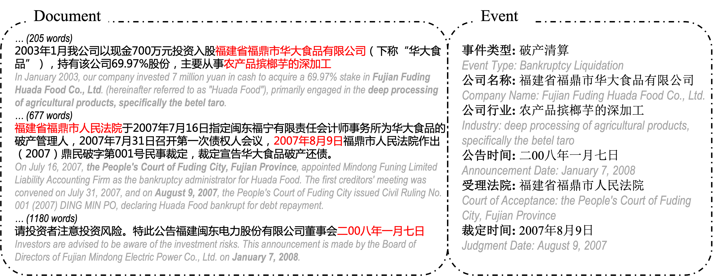

# DFREE

This project hosts the code for implementing the following paper:

> [**DFREE:A Dataset For Document-Level Financial Risk Event Extraction**](https://TODO)          
> Yubo Chen, Tong Zhou, Kang Liu, Jun Zhao

## Dataset



| **Key**          | **Value**   |
|------------------|-------------|
| Dataset Name     | DFREE       |
| Size             | 19,044      |
| Event Type       | 9           |
| Argument Type    | 38          |
| Event Range      | 960.06      |
| Event Count      | 1.86        |
| Document Length  | 2277.25     |

| Event Type                | Arguments                                                                                   |
|---------------------------|---------------------------------------------------------------------------------------------|
| Bankruptcy Liquidation    | Company Name, Industry, Announcement Date, Court of Acceptance, Judgment Date               |
| Major Safety Incident     | Number of Casualties, Company Name, Announcement Date, Other Impacts, Loss Amount           |
| Shareholder Reduction     | Reduction Start Date, Shareholder, Reduction Amount                                         |
| Equity Pledge             | Receiver, Pledge Start Date, Pledgor, Pledge End Date, Pledge Amount                         |
| Shareholder Increase      | Increase Start Date, Shareholder, Increase Amount                                           |
| Equity Freeze             | Freeze Start Date, Freeze End Date, Freeze Amount, Frozen Shareholder                       |
| Senior Executive Death    | Company Name, Death/Missing Date, Age at Death, Executive, Position                         |
| Major Asset Loss          | Company Name, Announcement Date, Other Losses, Loss Amount                                  |
| Major External Compensation | Company Name, Announcement Date, Compensation Recipient, Compensation Amount               |

Run `unzip DFREE_dataset.zip` to get the train and test set of DFREE.

## Usage

### Setup

Please use `Python 3(.10)` as well as the following packages:
```text
torch
transformers
vllm
numpy
tqdm
```

### HAC-Ann

#### 1. Data Collection

Crawl the latest announcements from [EastMoney](https://data.eastmoney.com/notices/).

Example code:
```
python spider/spider.py
```

#### 2. Manual Annotation

Please refer to the open-source text annotation tool [doccano](https://github.com/doccano/doccano).

#### 3. Rule-Based Filtering

Pre-label each document with event types based on rules using the following code:
```
python hac_ann/write_category_label.py
```
You can discard documents with no automatic labels.

#### 4. Model Filtering

First, start a local inference API service with vllm:
```
CUDA_VISIBLE_DEVICES=7 python -m vllm.entrypoints.openai.api_server \
    --served-model-name Qwen1.5-32B-Chat \
    --model Qwen/Qwen1.5-32B-Chat \
    --max-model-len 16384 \
    --port 11032
```

Label documents using the model:
```
python hac_ann/auto_label_qwen.py
```
You can discard data with an empty list of labels.

#### 5. Model Annotation

* Adjust prompts:
Prompts of different versions are saved in the `prompt/` folder and can be manually adjusted based on testing results.

* Large-scale annotation: Set up the API key and input/output file paths:
```
python hac_ann/auto_label_openai.py
```
Obtain the results after large-scale annotation.

### Training

Under the `baseline/` folder, first prepare the datasets for different methods, including formatted training and test sets:
```
python baseline/baseline_data_prepare.py
```

After preparing the data paths and model saving paths, you can train and test different methods:
* Event type classification:
```
python baseline/baseline_bert_classification.py
```

* MRC method:
The MRC method relies on the prediction results of the event classification model:
```
python baseline/bart_template.py
```

* NER method:
```
python baseline/bart_template.py
```

* SFT method:
```
bash finetune_gpt.sh
```


